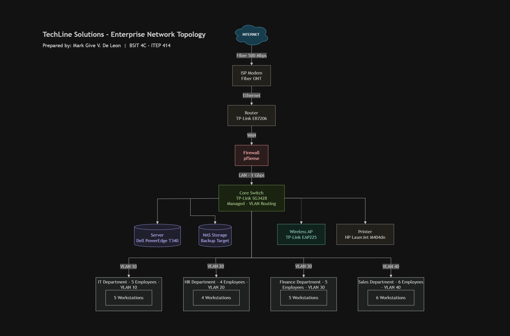

# Week 2 Portfolio Project – Enterprise Infrastructure Planning

## Project Overview
This project involved preparing a complete IT Infrastructure Plan for **TechLine Solutions**, a fictional 20-employee software startup with no existing computers, network, or infrastructure. Acting as the Junior System Administrator, I designed the hardware, software, and network setup from scratch, created a network topology diagram, and documented everything in a professional report.

The full detailed report is available here: [EnterpriseInfrastructurePlan.pdf](./EnterpriseInfrastructurePlan.pdf)

---

## Learning Objectives
- Analyze the IT requirements of a small business based on its departments and headcount.
- Prepare professional hardware, software, and network inventories.
- Design an enterprise network topology using proper networking symbols.
- Research real-world System Administration roles and how they collaborate.
- Communicate infrastructure planning decisions in professional technical documentation.

---

## Company Scenario
**TechLine Solutions** is a newly established software development startup with 20 employees across four departments. The company currently has no computers, server, network, or internet infrastructure, so the entire IT setup needed to be planned from the ground up.

| Department | Employees |
|---|---|
| Information Technology | 5 |
| Human Resources | 4 |
| Finance | 5 |
| Sales | 6 |
| **Total** | **20** |

---

## Hardware Inventory Summary

| Hardware | Quantity | Purpose |
|---|---|---|
| Desktop Computer | 14 | Workstations for HR, Finance, and Sales |
| Laptop | 6 | Portable workstations for IT staff |
| Server | 1 | File storage, backups, internal hosting |
| Switch | 2 | Distributes wired connections across departments |
| Wireless Access Point | 2 | Wi-Fi coverage across the office |
| Printer | 2 | Shared printing between departments |
| NAS Storage | 1 | Centralized file storage and backup |
| UPS | 3 | Power protection for server and network gear |
| Monitor | 20 | Display for all workstations |

Full inventory with justifications is available in the [PDF report](./EnterpriseInfrastructurePlan.pdf).

---

## Software Inventory Summary

| Software | License | Purpose |
|---|---|---|
| Windows 11 Pro | Volume License | Primary OS for employee workstations |
| Ubuntu Server | Free / Open Source | Operating system for the company server |
| Microsoft Office 365 | Subscription | Daily productivity tasks |
| Git & GitHub Desktop | Free | Version control for the IT/development team |
| VS Code | Free / Open Source | Code editor for development |
| VirtualBox | Free / Open Source | Testing environments for IT |
| Microsoft Defender | Included with Windows | Baseline antivirus protection |
| AnyDesk | Free | Remote support for IT troubleshooting |

Full inventory with justifications is available in the [PDF report](./EnterpriseInfrastructurePlan.pdf).

---

## Enterprise Network Diagram

The diagram shows traffic flowing from the internet through the ISP modem, router, and firewall, into the core switch, which connects to the server, NAS storage, printer, and wireless access point, and distributes to all four departments.

Full-resolution version: [network-topology.pdf](./diagrams/network-topology.pdf)

---

## Technologies Used
- **Draw.io** – network topology design
- **Git & GitHub** – version control and documentation hosting
- **Markdown** – technical documentation formatting

---

## Challenges Encountered
The most challenging part of this project was designing the network diagram in Draw.io, since it required learning how to use proper networking symbols and organize a clean, readable layout showing the flow from the internet down to each department. Deciding on realistic hardware quantities for a 20-person company also required careful reasoning rather than guesswork, to avoid over- or under-provisioning equipment.

---

## Reflection
This project shifted my understanding of System Administration from just fixing problems to also planning infrastructure before it exists. Working through the hardware, software, and network inventories showed me how many small decisions require real reasoning, and designing the network diagram helped me think about how information actually flows through a company. Full reflection is available in the [PDF report](./EnterpriseInfrastructurePlan.pdf).

---

## References
- [CompTIA](https://www.comptia.org)
- [Red Hat RHCSA Certification](https://www.redhat.com/en/services/certification/rhcsa)
- [Cisco Network Administrator Careers](https://www.cisco.com/site/us/en/learn/training-certifications/tech-roles/network-administrator.html)
- [Cloud Administrator Roadmap – WebAsha](https://www.webasha.com/blog/your-roadmap-to-becoming-a-cloud-administrator-key-skills-and-tools)
