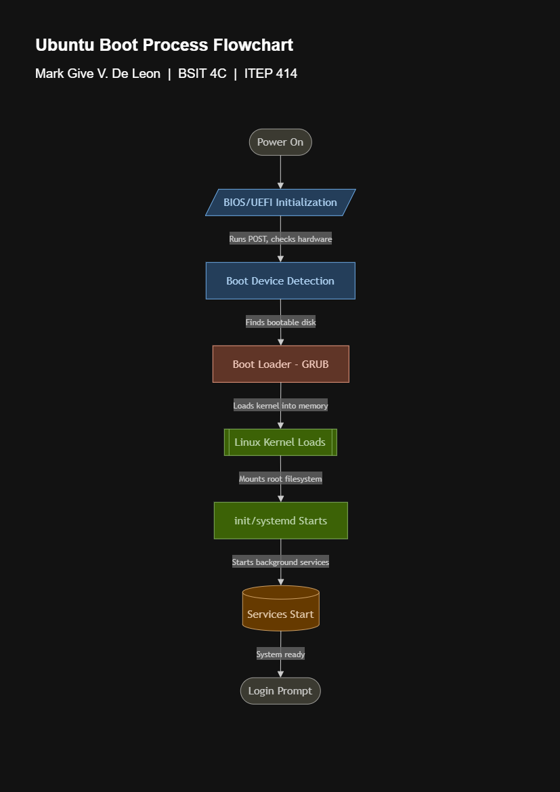

# Week 3 – Enterprise Server Deployment and Operating System Installation

## Project Overview
This project covers the deployment of an Ubuntu Server 26.04 LTS virtual machine for TechLine Solutions, a fictional startup preparing to host file sharing, remote administration, database, web, and internal services. The project was completed in the role of a Junior System Administrator, covering installation, configuration, SSH setup, and verification of the server.

## Learning Objectives
- Explain the purpose of an operating system in enterprise environments
- Differentiate BIOS and UEFI firmware
- Explain the stages of the computer boot process
- Compare Ubuntu Server, Windows Server, and Rocky Linux
- Install and configure a Linux server in a virtual environment
- Enable secure remote administration using SSH
- Verify server functionality through command-line checks
- Produce professional technical documentation

## Virtual Machine Specifications

| Component | Specification |
|---|---|
| Name | Ubuntu-Server-Week03 |
| RAM | 4 GB |
| CPU | 2 virtual processors |
| Storage | 40 GB (VDI) |
| Network | NAT |
| OS | Ubuntu Server 26.04 LTS |

## Installation Summary
Ubuntu Server was installed with English language and keyboard settings, DHCP-assigned networking, hostname `server01`, guided full-disk partitioning with LVM enabled (2 GB /boot partition, remaining space as an LVM volume group), and OpenSSH Server enabled during setup. No additional server snaps were installed beyond the base system.

## Configuration Summary
- Hostname: `server01`
- Assigned IP address: `10.0.2.15`
- Filesystem: ext4
- Partition scheme: Guided LVM (boot partition + LVM volume group)
- SSH: Installed and enabled during setup, password authentication enabled
- User account created with sudo privileges

## Verification Results

| Check | Command | Result |
|---|---|---|
| Login | N/A | Successful |
| Hostname | `hostname` | `server01` |
| IP Address | `ip addr` | `10.0.2.15` confirmed |
| Internet Connectivity | `ping -c 4 google.com` | 4/4 packets received, 0% packet loss |
| System Update | `sudo apt update && sudo apt upgrade -y` | Completed successfully after mirror fix |
| SSH Status | `systemctl status ssh` | `active (running)` |

## BIOS vs UEFI Highlights
UEFI has largely replaced BIOS in modern systems due to support for larger disk sizes through GPT partitioning (BIOS is capped at 2TB via MBR), faster boot times, and built-in security features like Secure Boot. UEFI also provides a graphical setup interface, while BIOS is limited to plain text menus. These improvements are the main reasons nearly all computers built in the last several years use UEFI, including it being a requirement for Windows 11. The full comparison table and detailed write-up are in `BIOS_vs_UEFI.pdf`.

## Boot Process Flowchart

The Ubuntu boot process follows eight stages: Power On → BIOS/UEFI Initialization → Boot Device Detection → Boot Loader (GRUB) → Linux Kernel Loads → init/systemd Starts → Services Start → Login Prompt.

## Challenges Encountered
- The virtual machine crashed unexpectedly right after the user profile setup screen during the first installation attempt, requiring a full restart. This was resolved by navigating installer screens with Tab instead of arrow keys.
- During the system update step, one package (`linux-firmware-amd-misc`) failed to download from the regional Philippine mirror (`ph.archive.ubuntu.com`) with a 403 Forbidden error. This was resolved by switching the APT source to the global Ubuntu archive mirror using `sed`, then re-running the update. The failed package was confirmed to be non-essential AMD GPU firmware, not needed in a virtualized environment.

## Reflection

Going into this project, I hadn't worked with Ubuntu Server before, only the desktop version a little, so setting up a server entirely through the command line felt intimidating at first. The installer itself was straightforward once I got used to navigating it, but I ran into a problem almost immediately when the VM crashed right after I finished the user profile screen. I figured out it was because I was using the arrow keys to move around instead of Tab, which apparently the installer doesn't handle well. It was a small thing, but it taught me that sometimes the reason something breaks isn't a big technical issue, it's just a workflow habit that doesn't match what the tool expects.

The bigger challenge came during the system update step. One package kept failing with a 403 Forbidden error, and at first I assumed I had done something wrong with the network setup. After digging into it, I found out it was actually the regional Philippine mirror that was having issues, not my configuration. Switching to the global Ubuntu archive mirror fixed it right away. What stuck with me from that experience is that troubleshooting isn't always about fixing your own mistakes, sometimes the problem is external and you just need to identify where it's actually coming from instead of assuming it's you.

Working through the verification steps afterward, like checking the hostname, confirming the IP address, testing connectivity, and verifying SSH was active, gave me a much clearer picture of what "the server is working" actually means in practice. It's not just about getting through an installer, it's about proving the thing you built actually does what it's supposed to do.

Researching BIOS versus UEFI also helped connect a lot of dots for me. I understood roughly what they were before, but breaking down the actual differences, like GPT versus MBR, Secure Boot, and disk size limits, made it clear why virtually every modern machine has moved to UEFI. Comparing Windows Server, Ubuntu Server, and Rocky Linux afterward reinforced that there's rarely a single "best" OS, it really depends on what a company already has and what they're trying to build.

Overall, this project gave me a much more realistic sense of what day-to-day system administration actually involves. It's less about following a checklist perfectly and more about troubleshooting calmly when something doesn't go as expected.

## References
- Ubuntu Server Documentation. https://ubuntu.com/server/docs
- Canonical Ubuntu Server Installation Guide. https://ubuntu.com/server/docs/install/step-by-step
- OpenSSH Documentation. https://www.openssh.com/manual.html
